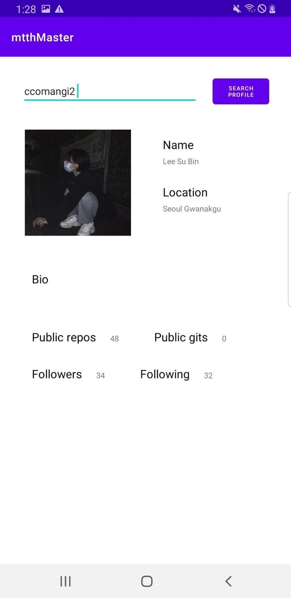
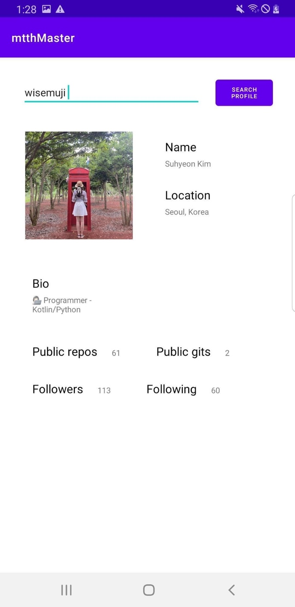
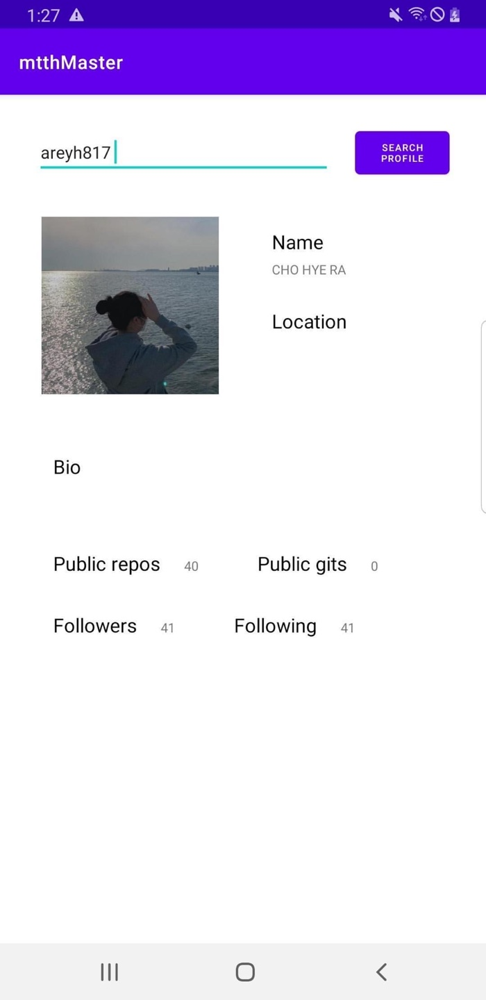

# MirimTechTalkHackathon
github API를 이용한 github user info 앱
<br>
<br>
<br>
### 실행화면
          
 
### 코드
 ```java
 public interface ProfileRemoteService {

    @GET("/users/{user}")
    Call<ProflieResponse> getPosts(@Path("user") String user);

}
```
여기서 반환되는 타입은 Call<객체타입>이다. 또한 @GET("/user/{user}")에 받을 수 있는 값이 필요하다 여기서는 {user} 임 !
<br>
<br>
<br>
 ```java
        Retrofit retrofit = new Retrofit.Builder()
                .baseUrl("https://api.github.com/")
                .addConverterFactory(GsonConverterFactory.create())
                .build();

        ProfileRemoteService profileremoteservice = retrofit.create(ProfileRemoteService.class);
```
baseUrl을 통해"https://api.github.com/"에 접속을 한다.
<br>
<br>
<br>
```java
        btnSearch.setOnClickListener(new View.OnClickListener() {
            @Override
            public void onClick(View view) {
                Call<ProflieResponse> call = profileremoteservice.getPosts(editId.getText().toString());

                call.enqueue(new Callback<ProflieResponse>() {
                    @Override
                    public void onResponse(Call<ProflieResponse> call, Response<ProflieResponse> response) {
                        if(response.isSuccessful()){
                            ProflieResponse profile = response.body();

                            // String type
                            name.setText(profile.getName());
                            location.setText(profile.getLocation());
                            bio.setText(profile.getBio());

                            // Image
                            Glide.with(getApplicationContext()).load(profile.getAvatar_url()).into(profileImage);

                            // int type
                            publicgits.setText(Integer.toString(profile.getPublicGits()));
                            publicrepos.setText(Integer.toString(profile.getPublicRepos()));
                            followers.setText(Integer.toString(profile.getFollowers()));
                            following.setText(Integer.toString(profile.getFollowing()));

                        }
                    }

                    @Override
                    public void onFailure(Call<ProflieResponse> call, Throwable t) {

                    }

                });
            }
        });
  ```
  viewmodel을 사용하지 않아 setText로 값을 직접 넣어준다.
  
<br>
<br>
<br>

### 참고자료
- https://github.com/HwangEunmi/Retrofit-Sample
- https://galid1.tistory.com/617
- https://purple-wood-lights.tistory.com/10
- https://kumgo1d.tistory.com/21

### 사용기술
* Android Studio
